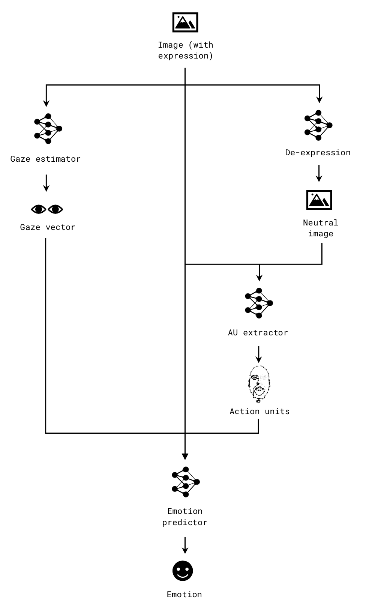

# Action unit and gaze-based emotion recognition

The idea is to implement an effective action unit (AU) and gaze detection
mechanism for in-the-wild scenarios. *I intend to propose a novel approach for
the following tasks.*

| Task | Output | References |
| -- | -- | -- |
| Facial de-expression | Action units | [Residue learning](http://openaccess.thecvf.com/content_cvpr_2018/papers/Yang_Facial_Expression_Recognition_CVPR_2018_paper.pdf), [Monkey-Net](http://openaccess.thecvf.com/content_CVPR_2019/papers/Siarohin_Animating_Arbitrary_Objects_via_Deep_Motion_Transfer_CVPR_2019_paper.pdf), [locating neutral expression in emotion space](https://www.tandfonline.com/doi/pdf/10.1080/13506280244000203a?needAccess=true)|
| Gaze detection | Gaze vector | [Relationship b/w gaze and emotion](https://sites.tufts.edu/emotiononthebrain/2014/10/24/the-look-and-feel-of-social-interactions-eye-gaze-emotion-and-social-perception/), [Averted gaze](Effects of direct and averted gaze on the perception of facially communicated emotion), [Emotion recognition in children with ASD ](https://link.springer.com/content/pdf/10.1007/s10803-009-0884-3.pdf)|

## 1. High-level architecture

## 2. Other uses

1. Can be extended to engagement/attention estimation
2. Some of the references already incorporate the unsupervised deep-fake video
   generation; my approach intended to be applicable to deep fake detection, too.

## 3. Formulation

Consider the following notations:

* $\mathcal{I}$ is an image with a recognisable face with occlusion of the order
  of in-the-wild images; the face is assumed to exhibit expressions of known
  kinds
* $\mathcal{I}_{\text{neutral}}$ is an image of the human face in $\mathcal{I}$
  without the expression in it; it is the ideal neutral image of the face in
  $\mathcal{I}$

### 1. Gaze estimator, $G$

Let $G$ be a non-linear mapping $\mathcal{I} \mapsto \mathbb{R}$ defined as $G:
\mathcal{I} \to \mathbf{g}$, where $\mathbf{g}$ is the gaze vector in
$\mathcal{I}$. More precisely,

$$
  \mathbf{\hat{g}} = G(\mathcal{I}; \mathbf{W}_G)
$$

where $\mathbf{W}_G$ is the parameter set of $G$.

### 2. De-expression, $D$

Let $D$ be a non-linear function $D: \mathcal{I} \to
\mathcal{I}_{\text{neutral}}$ given by

$$
  \mathcal{\hat{I}}_{\text{neutral}} = D(\mathcal{I};\mathbf{W}_D)
$$

In this module, the goal is to find the best $\mathbf{W}_D$ that results in
$\mathcal{\hat{I}}_{\text{neutral}} \approx \mathcal{I}_{\text{neutral}}$. That
is,

$$\mathbf{W}_D = \text{arg
max}_{\mathbf{W}}{P\left(D(\mathcal{I};\mathbf{W})\right)}$$

### 3. AU extractor, $A$

Given $\mathcal{I}$ and $\mathcal{I}_\text{neutral}$, $A$ is a non-linear
function $(\mathcal{I}, \mathcal{I}_\text{neutral}) \mapsto \mathbb{R}$ defined
as $A: (\mathcal{I}, \mathcal{I}_\text{neutral}) \to \mathbf{a}$. More
explicitly,

$$
\mathbf{\hat{a}} = A(\mathcal{I}, \mathcal{I}_\text{neutral} \vert \mathbf{W}_A)
$$

where $\mathbf{W}_A$ is the parameters set of the model $A$.

### 4. Emotion predictor, $E$

A non-linear mapping function $E: (\mathcal{I}, \mathbf{g}, \mathbf{a}) \to
\mathbb{R}$ is defined to predict a catagorical output denoting the emotion in a
frame of images. The triplet $(\mathcal{I}, \mathbf{g}, \mathbf{a})$ is obtained
from $G$, $D$, and $A$.

From a set of pre-defined emotions $\mathbf{e}$, we predict the emotion of the
frame of videos as

$$
  \text{arg max}_{e \in \mathbf{e}}P(e\vert\mathcal{I}, \mathbf{g},
  \mathbf{a},\mathbf{W}_E)
$$

## 4. Motives

1. I intend to build certain methods from scratch, because the final result
   depends on every component down the tree. Error in one component cascades
   down the path and can magnify.
2. The reason for generating action units is that existing methods are
   ineffective or computationally expensive in the wild [[4](#affectiva)]
3. Sufficient details can be inferred from an eye-gaze that differentiates an
   approaching emotion (happy, angry etc) from a repulsive one (sad,
   embarrassment, etc) [[3](#gaze1)]
4. I intend to focus a majority of my research efforts on de-expression since
   little literature exists [[2](#res)] and there is considerable scope for
   investigation towards a unsupervised de-expression network [[1](#fs)]

## 5. Queries

1. Other research work may coincide with mine during my PhD. Will there be room
   to modify my approach?
2. What is the ideal time I should be proposing my topic? What are the
   timelines?

## 6. Additional analysis
1. Analyze the de-expression output of a real image vs fake image.
2. Build a system that incorporates both de-expression and eye-gaze and outputs
the AU/emotion. This is similar to [[5](#mmAU)]

## References

1.  [Animating Arbitrary Objects via Deep Motion
   Transfer](http://openaccess.thecvf.com/content_CVPR_2019/papers/Siarohin_Animating_Arbitrary_Objects_via_Deep_Motion_Transfer_CVPR_2019_paper.pdf)
2.  [Facial Expression Recognition by De-expression Residue
   Learning](http://openaccess.thecvf.com/content_cvpr_2018/papers/Yang_Facial_Expression_Recognition_CVPR_2018_paper.pdf)
3.  [The “look and feel” of social
   interactions](https://sites.tufts.edu/emotiononthebrain/2014/10/24/the-look-and-feel-of-social-interactions-eye-gaze-emotion-and-social-perception/)
4. [AU detection using active
   learning](https://www.affectiva.com/wp-content/uploads/2017/03/Facial-Action-Unit-Detection-using-Active-Learning-and-an-Efficient-Non-Linear-Kernel-Approximation.pdf)
5. [Multi-Modality Empowered Network for Facial Action Unit Detection](https://ieeexplore.ieee.org/document/8659257)
